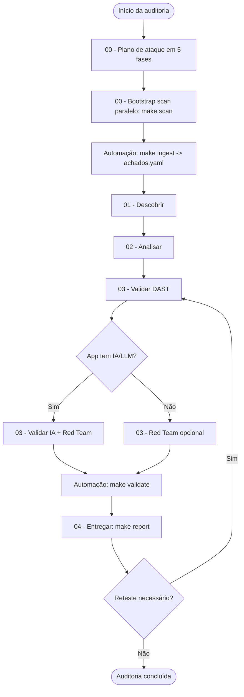

# Sistema de Auditoria de Segurança

Framework proprietário para auditorias web, infraestrutura e sistemas com IA/LLM/MCP.

> Versão **1.4** — automação CLI (`scripts/audit_tool.py`), bootstrap-scan concorrente/paralelo,
> validação estrita de schema, seleção de prompts e compilação de laudos;
> currency OWASP LLM Top 10 **2025**, OWASP ASVS **5.0**, CVSS **4.0**;
> ver o histórico em [`CHANGELOG.md`](CHANGELOG.md).

## Visão geral

| Pilar            | Pasta              | Objetivo                                               | Fase          |
| ---------------- | ------------------ | ------------------------------------------------------ | ------------- |
| **Orquestrador** | `00-orquestrador/` | Planejar escopo, sequência e entregáveis               | Pré-auditoria |
| **1. Descobrir** | `01-descobrir/`    | Mapear stack, superfície de ataque e componentes IA    | Fase 1        |
| **2. Analisar**  | `02-analisar/`     | Revisão estática de código, config e IaC               | Fase 2        |
| **3. Validar**   | `03-validar/`      | Confirmar explorabilidade (DAST, Red Team, IA)         | Fases 3–4     |
| **4. Entregar**  | `04-entregar/`     | Documentar, priorizar remediação e automatizar reteste | Fase 5        |
| **Automação**    | `scripts/`         | CLI unificado (`audit_tool.py`) para ingestão e laudos | Transversal   |
| **Catálogo**     | `catalog/`         | Índice estruturado de prompts para LLMs e agentes      | Transversal   |
| **Templates**    | `templates/`       | Schema de achados e estrutura de relatório             | Transversal   |

---

## Fluxo de execução



---

## Checklist por pilar

### Pré-auditoria — Orquestrador

- [ ] Definir escopo: URLs, repositórios, ambientes (dev/staging/prod)
- [ ] Obter autorização formal por escrito
- [ ] Executar `[plano-de-ataque-em-5-fases](00-orquestrador/plano-de-ataque-em-5-fases.md)`
- [ ] Rodar ingestão automatizada paralela: `make scan REPO=... PROD=...` (gera `pre-scan.md` e `raw-scans/`)
- [ ] Ingerir achados automáticos: `make ingest AUDIT=auditorias/{produto}-{data}` (popula `achados.yaml` com rascunhos)
- [ ] Selecionar prompts específicos do stack: `make select STACK=...` (economiza tokens de IA)

### Pilar 1 — Descobrir

Execute na ordem sugerida:

- [ ] `[fingerprint-de-stack-por-codigo-fonte](01-descobrir/fingerprint-de-stack-por-codigo-fonte.md)`
- [ ] `[mapeamento-de-superficie-de-ataque](01-descobrir/mapeamento-de-superficie-de-ataque.md)`
- [ ] `[mapeamento-de-rotas-e-endpoints-de-spa](01-descobrir/mapeamento-de-rotas-e-endpoints-de-spa.md)`
- [ ] `[mapeamento-de-integracoes-e-dados-compartilhados](01-descobrir/mapeamento-de-integracoes-e-dados-compartilhados.md)`
- [ ] `[analise-de-package-manifest-e-dependencias](01-descobrir/analise-de-package-manifest-e-dependencias.md)`
- [ ] *Se app usa IA:* `[identificacao-de-componentes-de-ia-e-vetores-especificos](01-descobrir/identificacao-de-componentes-de-ia-e-vetores-especificos.md)`
- [ ] *Se app usa LLM de terceiros:* `[analise-de-supply-chain-de-llm](01-descobrir/analise-de-supply-chain-de-llm.md)`

**Entregável:** Attack Surface Report consolidado no registro da auditoria.

### Pilar 2 — Analisar

Prioridade máxima primeiro:

- [ ] `[revisao-de-autenticacao-e-controle-de-acesso](02-analisar/revisao-de-autenticacao-e-controle-de-acesso.md)` — **obrigatório**
- [ ] `[revisao-de-injection-e-execucao-arbitraria](02-analisar/revisao-de-injection-e-execucao-arbitraria.md)`
- [ ] `[path-traversal-ssrf-e-validacao-de-entrada](02-analisar/path-traversal-ssrf-e-validacao-de-entrada.md)`
- [ ] `[analise-de-segredos-e-configuracao-insegura](02-analisar/analise-de-segredos-e-configuracao-insegura.md)`
- [ ] `[analise-de-criptografia-e-protecao-de-dados](02-analisar/analise-de-criptografia-e-protecao-de-dados.md)`
- [ ] *Se há frontend/SPA:* `[revisao-de-xss-e-seguranca-client-side](02-analisar/revisao-de-xss-e-seguranca-client-side.md)`
- [ ] `[revisao-de-cors-csrf-e-headers-de-seguranca](02-analisar/revisao-de-cors-csrf-e-headers-de-seguranca.md)`
- [ ] `[revisao-de-logging-auditoria-e-deteccao](02-analisar/revisao-de-logging-auditoria-e-deteccao.md)` — A09, base de detecção
- [ ] *Se desserializa/transações concorrentes:* `[revisao-de-desserializacao-e-race-conditions](02-analisar/revisao-de-desserializacao-e-race-conditions.md)`
- [ ] *Se há IaC:* `[revisao-de-iac-gerado-por-ia](02-analisar/revisao-de-iac-gerado-por-ia.md)`
- [ ] *Se há MCP/agentes:* `[analise-de-configuracao-de-mcp-e-escopo-de-tools](02-analisar/analise-de-configuracao-de-mcp-e-escopo-de-tools.md)`

**Entregável:** Rascunhos de achados com status `rascunho` em `achados.yaml`.

### Pilar 3 — Validar

#### DAST (Fase 3)

- [ ] `[geracao-de-casos-de-teste-por-endpoint](03-validar/dast/geracao-de-casos-de-teste-por-endpoint.md)` — preparar casos antes do Burp
- [ ] `[exploracao-de-idor-e-controle-de-acesso](03-validar/dast/exploracao-de-idor-e-controle-de-acesso.md)`
- [ ] `[teste-de-fluxos-de-autenticacao-e-account-takeover](03-validar/dast/teste-de-fluxos-de-autenticacao-e-account-takeover.md)`
- [ ] `[cenarios-de-abuso-de-logica-de-negocio](03-validar/dast/cenarios-de-abuso-de-logica-de-negocio.md)`
- [ ] *Se há frontend:* `[teste-de-xss-refletido-e-stored](03-validar/dast/teste-de-xss-refletido-e-stored.md)`
- [ ] `[teste-de-rate-limiting-brute-force-e-dos](03-validar/dast/teste-de-rate-limiting-brute-force-e-dos.md)`
- [ ] `[teste-de-upload-e-processamento-de-arquivo](03-validar/dast/teste-de-upload-e-processamento-de-arquivo.md)`
- [ ] `[analise-de-resposta-e-vazamento-de-informacao](03-validar/dast/analise-de-resposta-e-vazamento-de-informacao.md)`

#### Red Team (Fase 3–4)

- [ ] `[cadeia-de-exploracao-multi-vetor](03-validar/red-team/cadeia-de-exploracao-multi-vetor.md)` — após confirmar vulns individuais

#### Segurança de IA (Fase 4 — somente se aplicável)

- [ ] `[red-teaming-de-system-prompt](03-validar/ia/red-teaming-de-system-prompt.md)`
- [ ] `[probe-de-prompt-injection-indireta](03-validar/ia/probe-de-prompt-injection-indireta.md)`
- [ ] `[teste-de-consistencia-de-guardrails](03-validar/ia/teste-de-consistencia-de-guardrails.md)`
- [ ] `[avaliacao-de-vetor-rag-e-contaminacao-de-contexto](03-validar/ia/avaliacao-de-vetor-rag-e-contaminacao-de-contexto.md)`
- [ ] `[analise-de-tool-use-e-excessive-agency](03-validar/ia/analise-de-tool-use-e-excessive-agency.md)`
- [ ] `[analise-de-output-handling-inseguro](03-validar/ia/analise-de-output-handling-inseguro.md)` — LLM05, ponte com vulns web
- [ ] `[teste-de-denial-of-wallet-e-consumo-ilimitado](03-validar/ia/teste-de-denial-of-wallet-e-consumo-ilimitado.md)` — LLM10, impacto financeiro

**Entregável:** Achados com status `confirmado` + PoC reproduzível.

### Pilar 4 — Entregar (Fase 5)

- [ ] Para cada achado confirmado: `[ficha-tecnica-de-achado](04-entregar/ficha-tecnica-de-achado.md)`
- [ ] *Se há requisito regulatório:* `[mapeamento-de-conformidade](04-entregar/mapeamento-de-conformidade.md)`
- [ ] Validar schema e contagens: `make validate AUDIT=...` (ou `python3 scripts/audit_tool.py validate`)
- [ ] Gerar laudo compilado: `make report AUDIT=...` (ou `python3 scripts/audit_tool.py report`)
- [ ] Consolidar sumário executivo: `[sumario-executivo-de-pentest](04-entregar/sumario-executivo-de-pentest.md)`
- [ ] Planejar correções: `[roadmap-de-remediacao-por-sprint](04-entregar/roadmap-de-remediacao-por-sprint.md)`
- [ ] Automatizar reteste: `[geracao-de-script-de-scan-automatizado](04-entregar/geracao-de-script-de-scan-automatizado.md)`
- [ ] Validar correções: `[plano-de-reteste-por-achado](04-entregar/plano-de-reteste-por-achado.md)`

---

## Matriz de decisão rápida


| Tipo de alvo         | Pilares obrigatórios  | Pular              |
| -------------------- | --------------------- | ------------------ |
| API REST             | bootstrap, 1, 2, 3-DAST, 4 | IA, XSS client-side |
| SPA + backend        | bootstrap, 1, 2, 3, 4 | —                  |
| App com LLM/agente   | Todos (inc. LLM05/LLM10) | —               |
| Infra/IaC only       | bootstrap, 1 (parcial), 2, 4 | DAST, IA    |
| Reteste pós-correção | `plano-de-reteste-por-achado`, 3 (casos afetados) | 1–2 se stack mudou |


---

## Schema de achados

Todos os achados confirmados devem ser registrados em YAML seguindo `[templates/registro-de-achado.yaml](templates/registro-de-achado.yaml)`.

### Campos do schema


| Campo           | Valores                                            | Descrição                            |
| --------------- | -------------------------------------------------- | ------------------------------------ |
| `id`            | `AUD-001`                                          | Identificador sequencial             |
| `titulo`        | string                                             | Título descritivo e específico       |
| `severidade`    | critico | alto | medio | baixo | info              | Classificação de risco               |
| `cvss`          | string                                             | Score e vetor CVSS 4.0 (3.1 aceito)  |
| `owasp`         | string                                             | OWASP Top 10 (2021/2025) ou OWASP LLM Top 10 (2025) |
| `cwe`           | string                                             | CWE-ID quando aplicável              |
| `pilar`         | descobrir | analisar | validar                     | Pilar de origem                      |
| `subpilar`      | dast | red-team | ia | null                         | Subpilar de origem (para Pilar 3)    |
| `status`        | rascunho | confirmado | falso_positivo | corrigido | Estado atual                         |
| `prompt_origem` | string                                             | Arquivo de prompt que gerou o achado |
| `deriva_de`     | `AUD-0XX` | null                                   | Achado de origem (correlação SAST→DAST) |
| `conformidade`  | mapa (lgpd/gdpr/soc2/iso27001/asvs/pci_dss/nist_csf/cis) | Controles violados (opcional)  |
| `localizacao`   | string                                             | Path, arquivo ou linha afetada       |
| `descricao`     | string                                             | Detalhamento técnico da causa raiz   |
| `poc`           | string                                             | curl ou passos para reproduzir PoC   |
| `impacto`       | string                                             | Consequência da exploração           |
| `remediacao`    | string                                             | Correção técnica recomendada         |
| `referencias`   | lista de strings                                   | Links/documentos adicionais          |
| `evidencias`    | string (caminho da pasta)                          | Diretório com logs e capturas        |
| `data_descoberta`| string (YYYY-MM-DD)                               | Data em que o achado foi detectado   |
| `data_correcao` | string (YYYY-MM-DD) \| null                        | Data da remediação ou null           |
| `reteste`       | pendente \| aprovado \| reprovado                  | Estado de validação da correção      |


### Blocos de topo do `achados.yaml`

Além da lista `achados`, o arquivo tem três blocos de topo:

- **`meta`** — `produto`, `data_inicio`, `data_fim`, `auditor`, `escopo`, `versao_framework`.
- **`resumo`** — contagem por severidade (`total`, `critico`, `alto`, `medio`, `baixo`, `info`), mantida em sincronia com a lista.
- **`cobertura`** (recomendado) — `endpoints_total`/`endpoints_testados`, `componentes_ia_total`/`componentes_ia_testados` e uma `observacao`; mede quanto da superfície foi de fato exercida.

### Severidade — guia rápido


| Nível       | Critério                                                       |
| ----------- | -------------------------------------------------------------- |
| **Crítico** | Exploração remota sem auth, RCE, vazamento massivo de PII      |
| **Alto**    | IDOR com dados sensíveis, bypass de auth, SSRF interno         |
| **Médio**   | XSS stored, CSRF em ação sensível, info disclosure parcial     |
| **Baixo**   | Headers ausentes, verbose errors, misconfig sem exploit direto |
| **Info**    | Observação sem exploit, hardening recomendado                  |


---

## Estrutura de uma auditoria

```
auditorias/
└── {produto}-{YYYY-MM-DD}/
    ├── pre-scan.md           # Output do bootstrap-scan.sh (scanners base)
    ├── raw-scans/            # Saídas brutas dos scanners
    ├── achados.yaml          # Registro vivo de achados
    ├── attack-surface.md     # Output do Pilar 1
    ├── relatorio-final.md    # Cópia preenchida do template
    └── evidencias/           # Screenshots, requests, logs
        ├── AUD-001/
        └── AUD-002/
```

---

## Ferramentas recomendadas por pilar


| Pilar        | Ferramentas                                            |
| ------------ | ------------------------------------------------------ |
| Bootstrap    | `bootstrap-scan.sh` (orquestra os scanners abaixo)     |
| Descobrir    | Katana, nuclei (passivo), manual                       |
| Analisar     | Semgrep, TruffleHog/Gitleaks, Checkov, Trivy, osv-scanner, mcp-scan |
| Validar DAST | Burp Suite, OWASP ZAP, ffuf                            |
| Validar IA   | Garak, Promptfoo, PyRIT, manual                        |
| Entregar     | Script gerado + CI/CD (GitHub Actions)                 |


---

## Índice completo de prompts

### 00-orquestrador

- [plano-de-ataque-em-5-fases](00-orquestrador/plano-de-ataque-em-5-fases.md)
- [bootstrap-scan-automatizado](00-orquestrador/bootstrap-scan-automatizado.md) (+ `bootstrap-scan.sh`)

### 01-descobrir

- [fingerprint-de-stack-por-codigo-fonte](01-descobrir/fingerprint-de-stack-por-codigo-fonte.md)
- [mapeamento-de-superficie-de-ataque](01-descobrir/mapeamento-de-superficie-de-ataque.md)
- [mapeamento-de-rotas-e-endpoints-de-spa](01-descobrir/mapeamento-de-rotas-e-endpoints-de-spa.md)
- [mapeamento-de-integracoes-e-dados-compartilhados](01-descobrir/mapeamento-de-integracoes-e-dados-compartilhados.md)
- [identificacao-de-componentes-de-ia-e-vetores-especificos](01-descobrir/identificacao-de-componentes-de-ia-e-vetores-especificos.md)
- [analise-de-supply-chain-de-llm](01-descobrir/analise-de-supply-chain-de-llm.md)
- [analise-de-package-manifest-e-dependencias](01-descobrir/analise-de-package-manifest-e-dependencias.md)

### 02-analisar

- [revisao-de-autenticacao-e-controle-de-acesso](02-analisar/revisao-de-autenticacao-e-controle-de-acesso.md)
- [revisao-de-injection-e-execucao-arbitraria](02-analisar/revisao-de-injection-e-execucao-arbitraria.md)
- [path-traversal-ssrf-e-validacao-de-entrada](02-analisar/path-traversal-ssrf-e-validacao-de-entrada.md)
- [analise-de-segredos-e-configuracao-insegura](02-analisar/analise-de-segredos-e-configuracao-insegura.md)
- [analise-de-criptografia-e-protecao-de-dados](02-analisar/analise-de-criptografia-e-protecao-de-dados.md)
- [revisao-de-xss-e-seguranca-client-side](02-analisar/revisao-de-xss-e-seguranca-client-side.md)
- [revisao-de-cors-csrf-e-headers-de-seguranca](02-analisar/revisao-de-cors-csrf-e-headers-de-seguranca.md)
- [revisao-de-logging-auditoria-e-deteccao](02-analisar/revisao-de-logging-auditoria-e-deteccao.md)
- [revisao-de-desserializacao-e-race-conditions](02-analisar/revisao-de-desserializacao-e-race-conditions.md)
- [revisao-de-iac-gerado-por-ia](02-analisar/revisao-de-iac-gerado-por-ia.md)
- [analise-de-configuracao-de-mcp-e-escopo-de-tools](02-analisar/analise-de-configuracao-de-mcp-e-escopo-de-tools.md)

### 03-validar/dast

- [geracao-de-casos-de-teste-por-endpoint](03-validar/dast/geracao-de-casos-de-teste-por-endpoint.md)
- [exploracao-de-idor-e-controle-de-acesso](03-validar/dast/exploracao-de-idor-e-controle-de-acesso.md)
- [teste-de-fluxos-de-autenticacao-e-account-takeover](03-validar/dast/teste-de-fluxos-de-autenticacao-e-account-takeover.md)
- [cenarios-de-abuso-de-logica-de-negocio](03-validar/dast/cenarios-de-abuso-de-logica-de-negocio.md)
- [teste-de-xss-refletido-e-stored](03-validar/dast/teste-de-xss-refletido-e-stored.md)
- [teste-de-rate-limiting-brute-force-e-dos](03-validar/dast/teste-de-rate-limiting-brute-force-e-dos.md)
- [teste-de-upload-e-processamento-de-arquivo](03-validar/dast/teste-de-upload-e-processamento-de-arquivo.md)
- [analise-de-resposta-e-vazamento-de-informacao](03-validar/dast/analise-de-resposta-e-vazamento-de-informacao.md)

### 03-validar/red-team

- [cadeia-de-exploracao-multi-vetor](03-validar/red-team/cadeia-de-exploracao-multi-vetor.md)

### 03-validar/ia

- [red-teaming-de-system-prompt](03-validar/ia/red-teaming-de-system-prompt.md)
- [probe-de-prompt-injection-indireta](03-validar/ia/probe-de-prompt-injection-indireta.md)
- [teste-de-consistencia-de-guardrails](03-validar/ia/teste-de-consistencia-de-guardrails.md)
- [avaliacao-de-vetor-rag-e-contaminacao-de-contexto](03-validar/ia/avaliacao-de-vetor-rag-e-contaminacao-de-contexto.md)
- [analise-de-tool-use-e-excessive-agency](03-validar/ia/analise-de-tool-use-e-excessive-agency.md)
- [analise-de-output-handling-inseguro](03-validar/ia/analise-de-output-handling-inseguro.md)
- [teste-de-denial-of-wallet-e-consumo-ilimitado](03-validar/ia/teste-de-denial-of-wallet-e-consumo-ilimitado.md)

### 04-entregar

- [ficha-tecnica-de-achado](04-entregar/ficha-tecnica-de-achado.md)
- [mapeamento-de-conformidade](04-entregar/mapeamento-de-conformidade.md)
- [sumario-executivo-de-pentest](04-entregar/sumario-executivo-de-pentest.md)
- [roadmap-de-remediacao-por-sprint](04-entregar/roadmap-de-remediacao-por-sprint.md)
- [geracao-de-script-de-scan-automatizado](04-entregar/geracao-de-script-de-scan-automatizado.md)
- [plano-de-reteste-por-achado](04-entregar/plano-de-reteste-por-achado.md)

### ci-cd (segurança contínua)

- [security-audit.yml](ci-cd/security-audit.yml) — workflow GitHub Actions para o repo alvo
- [README](ci-cd/README.md) — instalação, política de branch protection e leitura de resultados

